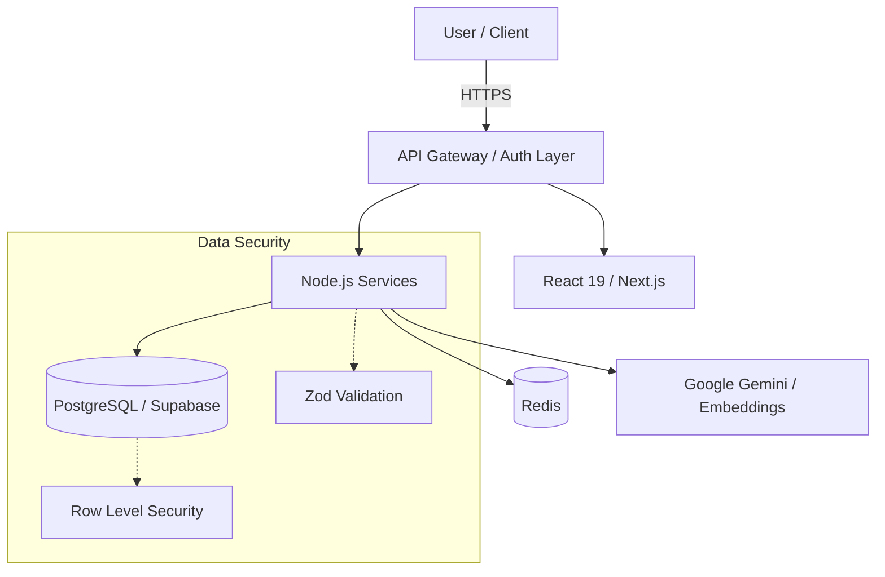

# André Rogério — IT Department, Scranton Branch

*“I am fast. To give you a reference point, I’m somewhere between a snake and a mongoose… and a python script.”*

## 🏢 Employee Record
**Employee:** André Rogério (TheyDreez)  
**Department:** IT & Solutions Support  
**Branch:** Scranton (Remote)  
**Current Role:** IT Analyst  
**Focus:** Application Support / IT Solutions / Automation / Software Engineering  
**Career Direction:** IT Solutions -> Cloud/AI -> Solution Architecture  

*Note: Please stop asking if we have more toner. We don’t. Submit a ticket.*

## 🏆 The Dundies (Core Proficiencies)
- **🏆 Best Ticket Troubleshooter:** Diagnosing the undiagnosable since day one.
- **🏆 Most Likely to Automate It:** If I do it twice, I write a script for it.
- **🏆 Best SQL Query at 5:47 PM:** For when the report is due at 6:00 PM.
- **🏆 The "Have You Tried Turning It Off and On Again" Lifetime Achievement Award.**

## 🗄️ Dunder Mifflin IT Stack
* **Paperwork (Productivity):** Microsoft 365, SharePoint, Teams
* **Operations (ITSM/ERP):** ServiceNow, SAP, Sienge ERP
* **Engineering (Code):** Python, TypeScript, React, Node.js, SQL
* **Infrastructure (Systems):** Active Directory, Entra ID, Intune, DNS, DHCP, TCP/IP
* **Cloud/AI:** Google Cloud, Google Gemini

## 📂 Projects That Definitely Didn't Start as "Just a Quick Script"

### [Onboarding OS](https://github.com/TheyDreez/onboarding-os-portfolio)
An automated state-machine-driven pipeline for HR and IT onboarding. It ensures new hires actually get their laptops on day one.  
**Tech:** React 19, Node.js, PostgreSQL, Supabase  
**Status:** In Development (Target End of 2026)

### [Internal Ticketing System](https://github.com/TheyDreez/ticketing-system-portfolio)
An AI-augmented internal ticketing platform to track SLAs and deflect common requests before they reach the IT desk.  
**Tech:** Next.js 16, TypeScript, Supabase, Google Gemini 2.5 Flash  
**Status:** Approaching Beta (22 Pilot Users)

### [Memory Lens](https://github.com/TheyDreez/memory-lens-portfolio)
A 3D spatial interface for clustering and searching massive document collections using AI embeddings. Finding the needle in the haystack without burning down the barn.  
**Tech:** React Three Fiber, Node.js, Google Gemini API, Vector DB  
**Status:** MVP Experimental

---
*(Camera zooms in through the blinds. Dwight is seen silently nodding at the security architecture diagram on the monitor.)*
---

## ⚙️ What I Actually Build
> *This section is fully serious. No jokes. Just engineering.*

When I am not solving day-to-day operational issues, I engineer resilient, secure, and scalable IT solutions. My focus is on eliminating manual toil through intelligent automation and robust application architecture.

### Architecture & Backend
I design systems using feature-based architecture with clear separation of concerns (Controllers/Services/Middleware). My backend services are built primarily on **Node.js/Express** and **Next.js API Routes**, implementing strict state-machine workflows to prevent invalid data states. I leverage **PostgreSQL** and **Supabase** with versioned migrations and Row Level Security (RLS) to enforce tenant-aware data access. 

### Security & Integrations
Security is integrated at the code level, including:
- **Authentication:** JWT, expiring magic links, HttpOnly cookies.
- **Data Protection:** AES-256-GCM encryption for sensitive records, bcrypt hashing, Zod input sanitization.
- **Integrations:** I build event-driven webhook architectures and integrate with third-party tools like ZapSign, DocuSeal, and various enterprise ITSM/ERP systems.

### AI & Automation
I augment applications with AI (e.g., **Google Gemini 2.5 Flash**) not as a novelty, but as a deterministic layer to handle intent recognition and semantic search (via Vector Databases), deflecting tier-1 support tickets and intelligently routing complex issues.

